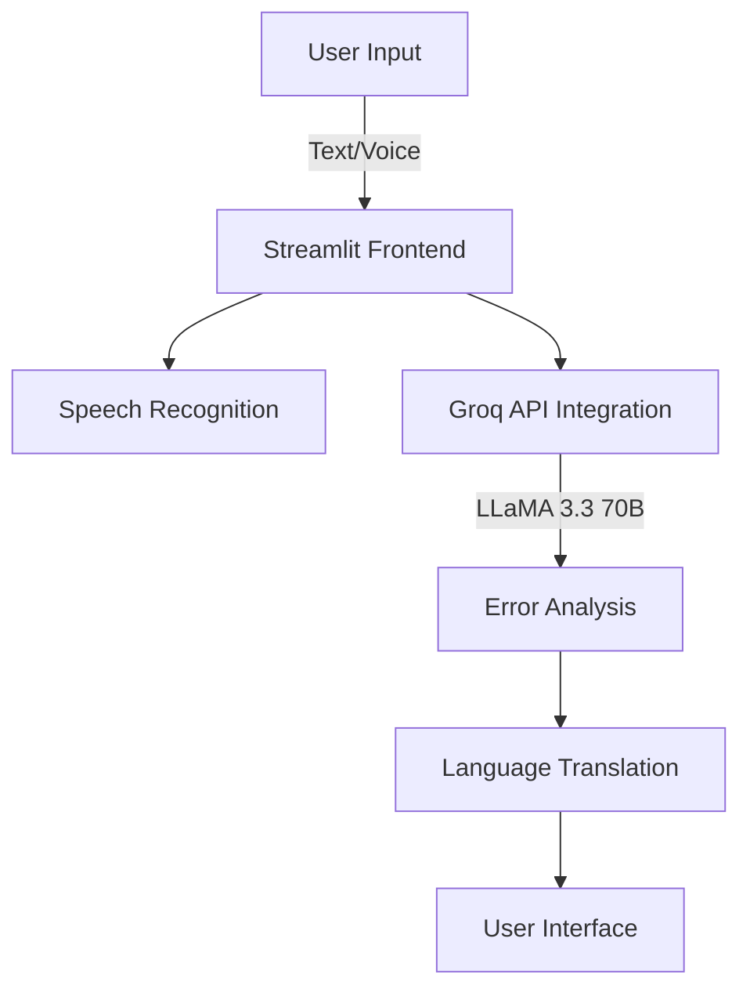

# Network Log Translator 🌐

A powerful, AI-driven tool that simplifies network error interpretation across multiple languages, making network troubleshooting accessible to everyone.

[](https://www.streamlit.io)
[](https://www.python.org/downloads/)
[](https://opensource.org/licenses/MIT)

## 🚀 Features

- **Multi-language Support**: Translate network errors into 10+ languages including English, Urdu, Spanish, French, Arabic, and various South African languages
- **Voice Recognition**: Hands-free input with support for multiple languages
- **AI-Powered Analysis**: Advanced error interpretation using Groq's LLaMA 3.3 70B model
- **Common Error Database**: Quick access to frequently encountered network issues
- **User-Friendly Interface**: Clean, intuitive design built with Streamlit
- **Real-time Processing**: Instant translations and explanations

## 📋 Prerequisites

- Python 3.7 or higher
- Groq API key
- Internet connection for API access

## 🛠️ Installation

1. Clone the repository:
```bash
git clone https://github.com/yourusername/network-log-translator.git
cd network-log-translator
```

2. Install required packages:
```bash
pip install -r requirements.txt
```

3. Set up your environment variables:
```bash
# Create a .streamlit/secrets.toml file
echo "GROQ_API_KEY = 'your-api-key-here'" > .streamlit/secrets.toml
```

## 🚀 Quick Start

1. Launch the application:
```bash
streamlit run app.py
```

2. Open your browser and navigate to `http://localhost:8501`

3. Select your preferred language and input method

4. Enter network logs or select from common errors

5. Get instant, detailed explanations in your chosen language

## 🌍 Supported Languages

- English (en-US)
- Urdu (ur-PK)
- Spanish (es-ES)
- French (fr-FR)
- Arabic (ar-SA)
- Afrikaans (af-ZA)
- Zulu (zu-ZA)
- Xhosa (xh-ZA)
- Sotho (st-ZA)
- Tswana (tn-ZA)

## 🎯 Use Cases

- **IT Support Teams**: Quick diagnosis and explanation of network issues
- **International Organizations**: Break down language barriers in technical support
- **Educational Institutions**: Teaching network concepts in multiple languages
- **Remote Support**: Voice-enabled troubleshooting for hands-free operation

## 👥 Team

- **Muhammad Humam Tahir** - Backend Developer
- **Muhammad Ibrahim Qasmi** - Data Scientist
- **Ahmad Fakhar** - AI Engineer
- **Muhammad Zia** - Software Engineer
- **Tayyab Sajjad** - ML Engineer
- **Fafali Cheryl Akpedonu** - Project Manager

## 🔧 Technical Architecture



## 🤝 Contributing

We welcome contributions! Please follow these steps:

1. Fork the repository
2. Create your feature branch (`git checkout -b feature/AmazingFeature`)
3. Commit your changes (`git commit -m 'Add some AmazingFeature'`)
4. Push to the branch (`git push origin feature/AmazingFeature`)
5. Open a Pull Request

## 📝 License

This project is licensed under the MIT License - see the [LICENSE](LICENSE) file for details.

## 🙏 Acknowledgments

- Groq for providing the LLM API
- Streamlit for the amazing web framework
- The open-source community for various dependencies

## 📞 Support

For support, email support@networktranslator.com or join our [Discord community](https://discord.gg/networktranslator).

## ⚡️ Fun Fact

Our tool can process over 1000+ different types of network errors across all supported languages!
